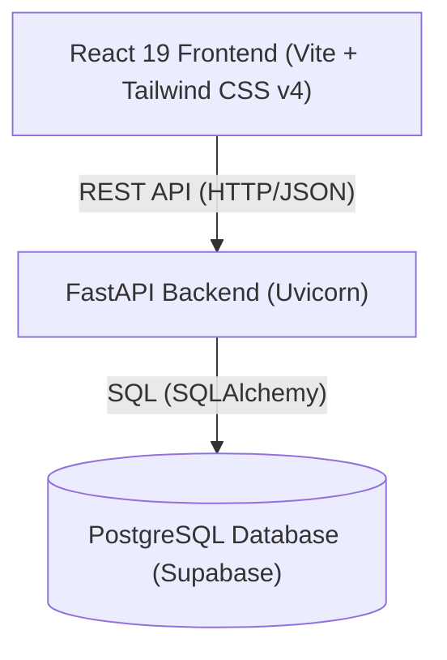

# Ethara - Inventory & Order Management System

Ethara is a premium, full-stack inventory, customer, and order management application. The project consists of a high-performance **FastAPI backend** backed by PostgreSQL (configured for Supabase), and a modern, responsive **React 19 + Vite frontend** styled with **Tailwind CSS v4**.

---

## 🚀 Key Features

*   **Interactive Dashboard**: Real-time sales and inventory metrics (revenue, total products, active customers, completed orders).
*   **Product Management**: CRUD operations to manage inventory levels, pricing, and details.
*   **Customer Directory**: Manage profiles, contact info, and associated order history.
*   **Order Fulfillment**: Link customers and products to create, calculate, and fulfill orders.
*   **Aesthetic UI**: Smooth micro-animations, Outfit/Inter typography, and clean, high-contrast layouts.
*   **Ready-to-Deploy**: Fully Dockerized backend and frontend config optimized for Vercel/Docker deployments.

---

## 🏗️ Architecture



---

## 🛠️ Tech Stack

*   **Frontend**: React 19, Vite, Tailwind CSS v4, Lucide React, ESLint
*   **Backend**: FastAPI, SQLAlchemy, Uvicorn, PostgreSQL (Psycopg2)
*   **Database**: Supabase PostgreSQL (Connection Pooling)
*   **Orchestration**: Docker, Docker Compose

---

## ⚙️ Project Structure

```
├── backend/                  # FastAPI Application
│   ├── controllers/          # Business logic handlers
│   ├── models/               # SQLAlchemy ORM definitions
│   ├── routes/               # FastAPI route endpoints
│   ├── schemas/              # Pydantic schemas for data validation
│   ├── services/             # Helper/external services
│   ├── database.py           # Database connection & engine setup
│   ├── main.py               # FastAPI entry point
│   ├── requirements.txt      # Python dependencies
│   └── Dockerfile            # Container build spec
├── frontend/ethara/          # React Web Application
│   ├── src/
│   │   ├── components/       # UI components (Dashboard, Sidebar, Products, etc.)
│   │   ├── services/         # API integration client
│   │   ├── App.jsx           # Main container
│   │   └── App.css           # Tailwind v4 import
│   ├── package.json          # Node dependencies & scripts
│   ├── vite.config.js        # Vite & Tailwind plugin setup
│   └── Dockerfile            # Frontend container build spec
└── docker-compose.yml        # Orchestration file for local services
```

---

## 🛠️ Local Development Setup

### Prerequisites
*   Python 3.12+
*   Node.js 20+
*   Docker & Docker Compose (optional)

### 1. Database Setup (`.env`)
Create a `.env` file in the root directory (and the `backend/` directory) with your database connection URL. Note that if your password contains special characters, they should be **URL-encoded** (e.g. `@` -> `%40`, `/` -> `%2F`, `*` -> `%2A`, `!` -> `%21`):

```env
DATABASE_URL=postgresql://<username>:<urlencoded-password>@<host>:<port>/<db_name>
```

---

### 2. Backend Setup
1. Navigate to the backend directory:
   ```bash
   cd backend
   ```
2. Create and activate a virtual environment:
   ```bash
   python3 -m venv venv
   source venv/bin/activate
   ```
3. Install dependencies:
   ```bash
   pip install -r requirements.txt
   ```
4. Run the Uvicorn development server:
   ```bash
   uvicorn main:app --reload --port 8000
   ```
   *The backend will be available at `http://localhost:8000`.*

---

### 3. Frontend Setup
1. Navigate to the frontend directory:
   ```bash
   cd frontend/ethara
   ```
2. Install npm packages:
   ```bash
   npm install
   ```
3. (Optional) Create a `.env` file to point to your backend:
   ```env
   VITE_API_URL=http://localhost:8000
   ```
4. Start the dev server:
   ```bash
   npm run dev
   ```
   *The frontend will run on `http://localhost:5173`.*

---

## 🐳 Docker Deployment & Local Run

### Using Docker Compose
You can spin up the entire stack (including a local Postgres database container) with:

```bash
docker compose up --build
```

### Running the Backend Image Individually
To run the pre-built backend Docker container:

```bash
docker run -p 8000:8000 --env-file .env annuvrat/ethara-backend:latest
```

---

## ☁️ Deploying the Frontend to Vercel

The frontend uses Tailwind CSS v4 and the `@tailwindcss/vite` plugin. To deploy to Vercel:

1. Install the Vercel CLI:
   ```bash
   npm install -g vercel
   ```
2. Run deployment from the frontend directory:
   ```bash
   cd frontend/ethara
   vercel --prod
   ```
3. Follow the CLI prompt to link and deploy. The setup will auto-detect Vite settings and deploy successfully.
